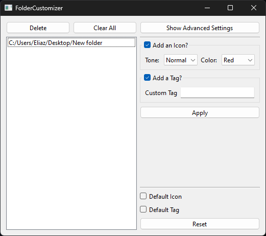

# Documentation
> Window Preview:

## Main menu 

- `[Delete]` - deletes the selected item on the list
- `[Clear All]` - deletes all items on the list
- `[Show Advanced Settings]` - *none, (for future features)*

## Costumization

- `[Add an Icon?]` - if enabled, will change the icon of the folder, else will be kept untouched
    - `[Tone]` - the tone that will be used for the folder icon
        - **options:** "Dark" | "Normal" | "Light"
    - `[Color]` - the color that will be used for the folder icon
        - **options:** "Red" | "Brown" | "Orange" | "Lemon" | "Green" | "Azure" | "Blue" | "Pink" | "Violet" | "White" | "Gray" | "Black"

 

- `[Add a Tag?]` - if enabled, will add tag to the folder, else will be kept untouched
    - **Default:** Adds the "{Tone} {Color}" as a tag
    - `[Custom Tag]` - if present, will modify the current tag with the provided value

 

- `[Apply]` - applies the costumization configuration to all the folders in the list

## Reset

- `[Default Icon]` - resets the current icon of the folder to the default one
- `[Default Tag]` - removes the current tag of the folder
- `[Reset]` - applies the reset configuration