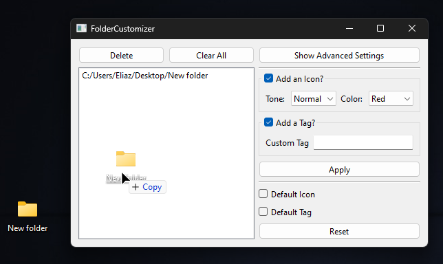

# Folder Customizer

- for modifying folder's icon and tag in windows 10 and 11

## Compatibility

- Windows 11
- Windows 10

## Features

📦 drag and drop folders
⬇️ reset folder icon/tag to default
⚡ file explorer integration
💻 cli supported

## How to use?

1. Drag and drop the folder you want to customize

2. Choose the `Tone` and `Color`, if you want to customize the icon
3. Fill up the `Custom Tag` if you want to set a custom tag (by default a tag will be set equal to the `${Tone} ${Color}` sequence)
4. Press `Apply`

> The option for installing context menu is under the advanced settings

## Installation

1. Go to releases and download `Folder_Customizer-Installer.exe`
2. Run it and follow the installation procedures

## Updates

1. Under advanced settings, click "Check Updates"

## Documentation

- you can view the detailed documentation <a href="./docs/docs.md">here</a>
